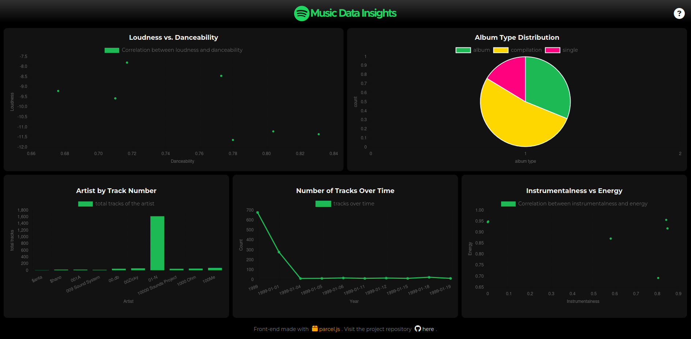

<div align="center">

</img>

</div>

<hr>

This repository aims to bring a bundle for the webapp. Both front-end and back-end have been dockerized to make it easy to run the applications.

<div align="center">



</div>

## Project repositories

### Front-end
Visit the project [here](https://github.com/giusgo/DLP-frontend).

### Back-end
Visit the project [here](https://github.com/Torrex123/Spotify).

## Installation

Install [Docker](https://docs.docker.com/get-docker/).

Create a folder to keep both repositories and build the application:

```bash
mkdir 'DLP-music-data-insights' && cd 'DLP-music-data-insights'
```

Clone both repositories (front-end and back-end):

```bash
git clone https://github.com/giusgo/DLP-frontend && git clone https://github.com/Torrex123/Spotify
```

Download the `docker-compose.yml` file in this repository:

```bash
wget https://raw.githubusercontent.com/giusgo/DLP-music-data-insights/main/docker-compose.yml
```

Build and run the application:

```bash
docker-compose up -d

# If using docker-compose-plugin
docker compose up -d
```

Open your web browser and go to `http://ip_address:5044`
